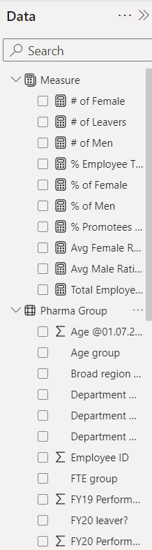
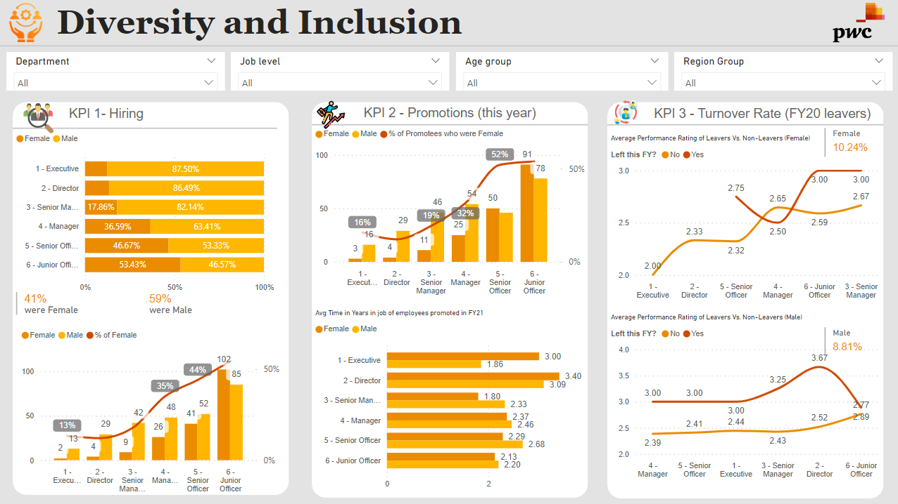
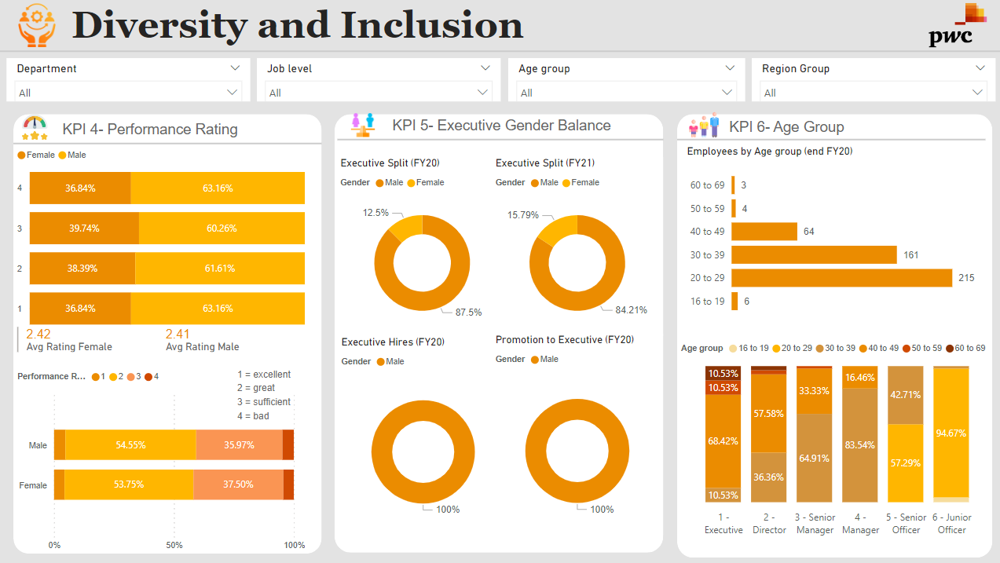

# Diversity and Inclusion Dashboard
## Overview
The Diversity and Inclusion Dashboard provides insights into the organization's diversity and inclusion landscape. It visualizes key metrics related to employee demographics, job levels, promotions, turnover, and diversity ratios. The dashboard aims to help stakeholders understand the current state of diversity and inclusion efforts and track progress over time.

## Dataset
The dataset used for this dashboard contains information about employee demographics, job levels, performance ratings, promotions, and turnover. Each record represents an employee in the organization.

## Model
The dashboard uses Power BI to visualize the data and create interactive visualizations.

## Visualization

## Usage
- Data Import: Import the provided dataset into Power BI.
- Data Preparation: Clean and shape the data as needed for analysis.
- Report Creation: Use the dataset to create visualizations that reflect the key metrics.
- Interactivity: Utilize slicers and filters for interactive analysis.
- Insights: Analyze the visualizations to gain insights into diversity and inclusion trends.

## Credits
This dashboard was created by Suraj Balraj as part of the PwC Power BI virtual case experience.
